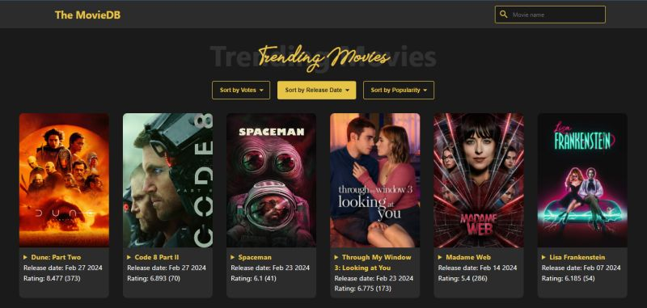

# 🎬 MovieDB

**MovieDB** is a dynamic and interactive web application that brings the world of cinema right to your screen! 🍿✨  

**Experience movie magic at its finest!** 🎬✨ Built with Vanilla JavaScript, this Movie Database offers an IMDb-style UI where you can explore, sort, and search movies effortlessly.

The project uses the open-source **The Movie Database (TMDb) API** to fetch real-time movie data.

## ✨ Features

- 🔍 **Search Movies**: Find your favorite and latest movies instantly.
- ⭐ **Vote-Based Listing**: Browse movies based on audience ratings.
- 📅 **Release Date Sorting**: Discover movies by release year.
- 🔥 **Popularity Filter**: See what’s trending worldwide.
- 📝 **Movie Overview**: Read quick summaries for each movie.
- ⚡ **Fast & Lightweight**: Built using pure Vanilla JavaScript.

## 🚀 Live Demo

No installation required — fully online!

Try it out here 👉 [MovieDb](https://thefaraazansari.github.io/movie-db/)

## 📸 Screenshot

## 🎯 Who is this for?

- Movie Buffs 🎥
- Frontend Developers 💻
- JavaScript Learners 🚀
- API Enthusiasts 🔌
- UI/UX Designers 🎨

---

Made with ❤️ by **Faraaz Ansari**
